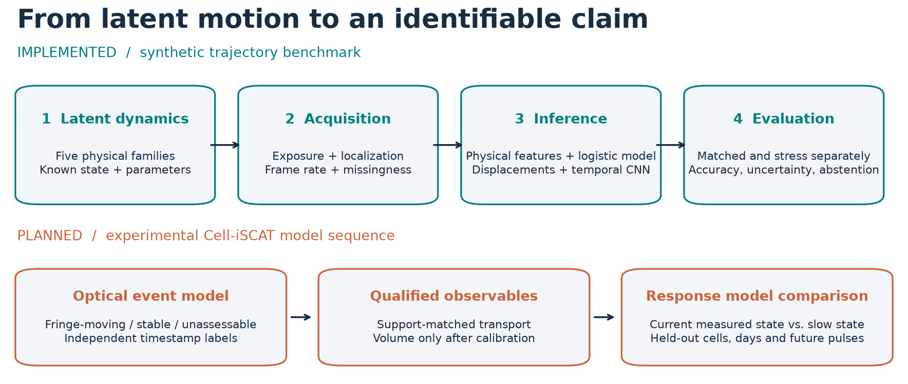

# Cell Biophysics ML

**When can intracellular motion be identified from what a microscope measures?**

This Python research project separates particle dynamics from measurement effects,
then tests how reliably models can distinguish motion under different acquisition
conditions. Its principal output is an **identifiability map with uncertainty**:
where inference works, where it fails, and when a model should abstain.

The longer-term Cell-iSCAT program asks whether intracellular transport retains
osmotic history after detectable membrane-fringe stabilization and, after
independent calibration, cell-volume recovery.

[Read the guide](docs/GUIDE.md) · [Scientific design](docs/scientific_design.md) ·
[Data schema](docs/data_schema.md) · [Result snapshot](docs/results/20260905/README.md)



## What is implemented?

| Component | Current status |
| --- | --- |
| Five latent motion families and a separate acquisition model | Implemented and tested |
| Physical-feature logistic regression, with/without acquisition metadata | Trained and evaluated on the same 50,000-trajectory synthetic dataset |
| Small temporal convolutional neural network (CNN) with metadata | Trained on GPU; predicts one label per complete trajectory |
| Matched/stress evaluation, calibration, abstention and bootstrap uncertainty | Implemented; separate results preserved |
| Cell-iSCAT optical-event analysis | Private annotation preparation completed locally; human labels/QC pending |
| Experimental event detector, calibrated volume and cell-response models | Planned; no trained or biologically validated model yet |

Snapshot: **5 September 2026**, package/simulator **0.1.1**. This documentation
release includes synthetic illustrations and compact synthetic result summaries.
Experimental pixels, trajectories, annotations and model weights are not bundled.

## A trajectory is an observation of motion


Gray lines show latent frame endpoints; colored points and lines show camera-like
observations. Each panel uses its own coordinate limits, with equal x/y scale.
These are illustrative simulations, not experimental tracks or representative
accuracy examples. The [guide](docs/GUIDE.md#the-five-motion-families) explains
the physical assumptions and the [figure manifest](docs/assets/figure-manifest.json)
records every parameter and seed.

## Architecture in brief

Two complementary inference paths consume **observed** trajectories:

- **Classical:** 19 trajectory summaries, optionally four declared acquisition
  features → median imputation and missing indicators → standardization →
  balanced multinomial logistic regression.
- **Temporal:** scaled x/y displacements and a validity channel → two 1D
  convolutions → validity-weighted pooling → five standardized acquisition
  features → a small classification head → five class probabilities.

Both classify a whole track. The temporal CNN does **not** locate individual
switching events or predict cell volume. See the [layer-by-layer architecture](docs/GUIDE.md#inference-models).

## What the benchmark currently tells us

The current comparison uses identical synthetic data and test IDs for all three
models: 30,000 training, 5,000 validation, 7,500 matched-test and 7,500 stress-test
trajectories. Classes are balanced within each split.

| Model | Matched accuracy, 95% CI | Stress accuracy, 95% CI | Matched / stress macro-F1 |
| --- | --- | --- | --- |
| Classical, trajectory only | 0.5732 [0.5627, 0.5840] | 0.3432 [0.3337, 0.3527] | 0.5692 / 0.3078 |
| Classical, measurement-aware | 0.5789 [0.5680, 0.5895] | 0.3472 [0.3369, 0.3564] | 0.5756 / 0.3263 |
| Temporal CNN, measurement-aware | 0.5535 [0.5419, 0.5632] | 0.3019 [0.2919, 0.3115] | 0.5489 / 0.2848 |


Acquisition shift causes substantial failure. At a fixed confidence threshold of
0.70, the measurement-aware classical model accepts 41.39% of stress tracks, but
only 43.27% of accepted predictions are correct. High confidence is not reliable
under this shift. Classical metadata-ablation accuracy differences include zero
in their paired 95% intervals; an advantage from metadata is not established here.

Intervals use 1,000 state-stratified whole-trajectory bootstrap resamples and
condition on the fitted models and simulator. They do not include training-seed
variability or establish transfer to biology. [Inspect the underlying metrics,
per-class results, provenance and limitations](docs/results/20260905/README.md).

## Quick start

Requires Python 3.11+. Run these commands from the repository root. A CPU is
sufficient for the smoke workflow; temporal benchmark training benefits from CUDA.

```bash
git clone https://github.com/PabloAu/Cell-biophysics-ml.git
cd Cell-biophysics-ml
python -m venv .venv
```

Activate the environment in your shell:

```powershell
# Windows PowerShell
.\.venv\Scripts\Activate.ps1
```

```bash
# Linux / macOS
source .venv/bin/activate
```

Install and run the functional example (the commands below also work in PowerShell):

```bash
python -m pip install -e ".[dev,ml,space]"
python scripts/generate_dataset.py --config configs/smoke.yaml
python scripts/train_baseline.py --data data/generated/smoke.jsonl.gz
python scripts/evaluate.py --data data/generated/smoke.jsonl.gz --model artifacts/classical/model.joblib
python -m pytest
python -m ruff check .
```

**Smoke output is for functional validation only.** Use
[the benchmark workflow](docs/GUIDE.md#run-the-benchmark) for reportable runs.
Generated datasets and checkpoints stay outside Git.

For an interactive synthetic trajectory explorer:

```bash
python space/app.py
```

Without a checkpoint, the explorer uses an explicitly labeled **heuristic
fallback**, not the evaluated model. The [guide](docs/GUIDE.md#use-the-local-explorer)
shows how to load a trained classical checkpoint and vary acquisition settings.

## Repository structure

```text
configs/                         Frozen simulator and model configurations
src/cell_biophysics_benchmark/
  simulation/                    Latent motion generators
  measurement/                   Exposure, localization and missing detections
  data/                          Generation, JSONL I/O and manifests
  features/                      Physical trajectory summaries
  models/                        Classical pipeline and temporal CNN
  evaluation/                    Classification, calibration and identifiability
  validation/                    Independent simulator cross-check
scripts/                         Generate, train, evaluate, plot and package
space/                           Python/Gradio synthetic explorer
experiments/                     Run records and earlier benchmark provenance
docs/GUIDE.md                    Scientific and practical walkthrough
docs/assets/                     Reproducible PNG/SVG figures and manifest
docs/results/20260905/            Current synthetic result snapshot
tests/                           Scientific and engineering regression tests
```

Local research preparation also includes a Python annotation viewer; that
unreleased work is separate from the benchmark checkout described here.

## Cell-iSCAT direction and limits

The first experimental target is **fringe-moving / fringe-stable within detection
limits / unassessable**, based on independent timestamp annotations. Fringe
stability, 2D area and trajectory geometry are not calibrated whole-cell volume.
Next steps are optical QC and annotation, qualified local transport/organization
summaries, independent volume calibration, and held-out comparisons of current-state
and slowly relaxing-state models. A one-cell pilot cannot establish population
behavior or a molecular mechanism.

Canonical Cell-iSCAT/CellTracker software owns tracking and segmentation. This
repository owns the ML adapters, measurement-aware benchmark and new evaluation
program. See the [experimental workflow](docs/GUIDE.md#cell-iscat-research-workflow)
and [data governance gate](docs/experimental_data_governance.md).

The simulator remains deliberately limited: 2D paths, circular confinement,
fractional Brownian subdiffusion, Brownian/directed switching and a coordinate-level
camera approximation. Photon/PSF image formation, tracking failures and biological
validation remain open. Independent AnDi checks currently cover only latent
Brownian and fractional-Brownian ensembles.

## Reproduce, contribute and cite

Regenerate all five figures with `python scripts/render_documentation.py`.
PNG previews and scalable SVG originals are included. Figures are computed with
NumPy/Matplotlib from the simulator and saved summaries; no microscopy images are
AI-generated or presented as experimental evidence.

See [contribution guidance](CONTRIBUTING.md), [license](LICENSE),
[citation metadata](CITATION.cff), [model card](MODEL_CARD.md) and
[dataset card](DATASET_CARD.md). The cards describe the foundation; the dated
[result snapshot](docs/results/20260905/README.md) supplies current evaluation.
Project handoff records are [AGENTS.md](AGENTS.md), [CONTEXT.md](CONTEXT.md),
[MEMORY.md](MEMORY.md) and [WORKLOG.md](WORKLOG.md).

Hugging Face dataset/model/Space destinations remain planned. Publication uses a
reviewed dry-run plan and explicit approval; this GitHub documentation update does
not upload those artifacts. See [release scope](docs/DOCUMENTATION_RELEASE.md).
