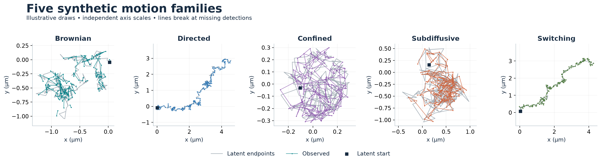
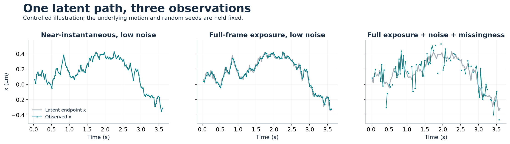
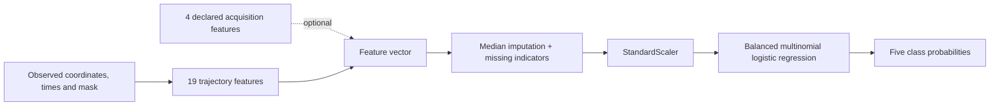
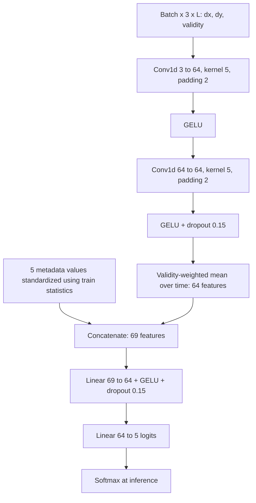
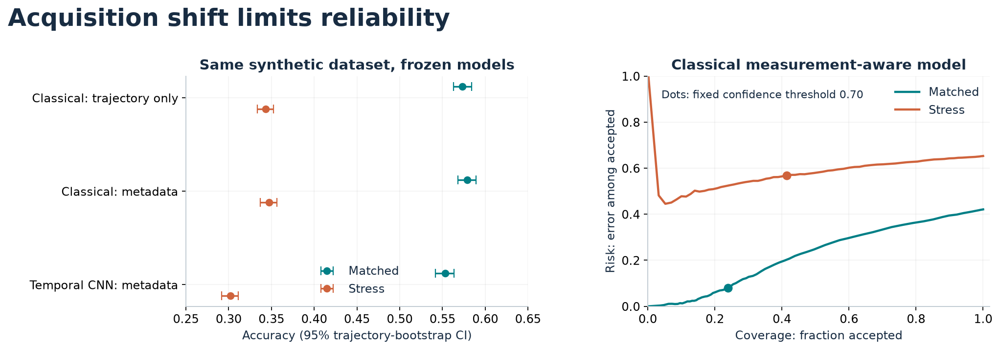
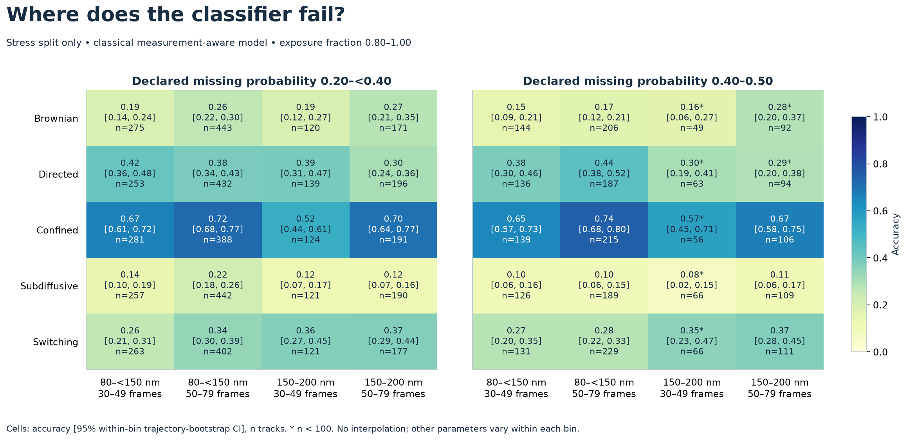

# Guide to Cell Biophysics ML

This guide connects the scientific question, the implemented Python models and
the proposed Cell-iSCAT experiments. Start with the [README](../README.md) for an
overview; use [the dated result snapshot](results/20260905/README.md) when quoting
numbers. Examples and figures in this guide are synthetic.

## The question we are testing

A particle can appear confined because it is physically restricted, because its
motion is small relative to localization error, or because the recorded trajectory
is too short to reveal larger-scale motion. A classifier may confidently assign
a label even when the available observations are insufficient.

We therefore vary both physical parameters and acquisition parameters. We ask how
each fitted model's accuracy, class confusion and confidence behave across these
regimes. The resulting **empirical identifiability map is model-dependent**; low
accuracy alone does not prove that no possible method could identify the process.

The biological extension asks whether transport after osmotic perturbation is
explained by the current measured cell state or needs an additional history-dependent
state. It first requires independent, trustworthy optical and transport measurements.

## The five motion families

| Label | Generator | What the label does not establish |
| --- | --- | --- |
| `brownian` | Isotropic Wiener motion with diffusion coefficient D | A particular cellular compartment or molecular interaction |
| `directed` | Brownian motion plus a constant drift vector | Motor-driven transport as the unique explanation |
| `confined` | Brownian motion reflected inside a circle | Real organelle geometry, binding or a measured pore size |
| `subdiffusive` | Fractional Brownian motion, alpha = 2H < 1 | A unique subdiffusion mechanism or proof of nonergodicity |
| `switching` | Markov switching between Brownian and directed dynamics | A frame-level segmentation output from the classifier |

Switching examples are conditioned on at least one realized frame-state transition.
A track labeled `switching` therefore cannot silently contain only one latent state.



For ordinary Brownian motion in two dimensions, the ideal ensemble MSD is
`4 D × lag`. For the fractional-Brownian generator it is `4 K_alpha × lag^alpha`.
The shared field name `diffusion_um2_s` holds a **generalized coefficient with units
µm²/s^alpha** in that latter case; interpreting it as ordinary D is incorrect.

These plots use fixed illustrative parameters and seeds, not examples selected
by prediction quality. Latent and observed coordinates share an origin; they
are not independently recentered. Equal x/y aspect is preserved within each panel,
but coordinate limits differ between panels. Do not compare panel widths as a
common physical scale. [Exact settings](assets/figure-manifest.json).

## The measurement layer

The simulator constructs a dense latent path with eight substeps per camera frame
in the benchmark configuration. The observation model then:

1. Averages dense positions over the final exposed fraction of each frame.
2. Adds independent, isotropic Gaussian localization error to x and y.
3. Drops detections using the declared missing probability.
4. Retains timestamps, a detection mask and latent frame endpoints separately.

Exposure averaging uses `ceil(exposure_fraction × oversample)` substeps, with at
least one substep for nonzero exposure. Exposure zero samples the endpoint. Thus
blur is a discretized approximation, not exact continuous integration. A safeguard
retains at least three observations, so missingness is not fully independent in
that corner case. This model produces coordinates, not photons or microscope images.



The middle panel changes exposure while preserving low localization noise. The
right panel additionally increases noise and missingness. The underlying dense path,
observation seed and time axis are shared. Line gaps correspond to missing positions;
they are not filled by interpolation. This is a controlled teaching example, not
the benchmark stress distribution or a biological recording.

### Data contract

Each gzip JSON Lines record represents one complete trajectory:

| Fields | Role |
| --- | --- |
| `sample_id`, `seed`, `simulator_version` | Identity and simulator provenance |
| `split`, `regime`, `state_label` | Frozen partition, acquisition regime and synthetic target |
| `t_s` | Frame times in seconds |
| `latent_xy_um`, `latent_state` | Synthetic reference path/state at frames |
| `observed_xy_um`, `observed_mask` | Model-visible positions and detection validity |
| `physical_params`, `acquisition_params` | Separate process and acquisition settings |

Missing observations serialize as `[null, null]`, and become NaNs with an explicit
Boolean mask in memory. Time remains on the original frame grid. Classifiers use
observations and permitted metadata, **not latent paths or physical ground truth**.
The [schema](data_schema.md) specifies alignment and versioning invariants.

## Inference models

### Classical physical-feature model

Implementation: [physical.py](../src/cell_biophysics_benchmark/features/physical.py)
and [classical.py](../src/cell_biophysics_benchmark/models/classical.py).



The 19 trajectory features comprise frame/observation counts, observed fraction,
duration, step statistics, net displacement, path length, straightness, efficiency,
radius of gyration, asymmetry, turning, displacement autocorrelation and MSD-derived
summaries (alpha, apparent diffusivity and plateau ratio).

The measurement-aware variant adds frame interval, exposure fraction, localization
sigma and declared missing probability: **23 raw features**, with imputation
indicators possibly expanding the fitted vector. Missing indicators and scaling are
fitted on training data only. Logistic regression uses L-BFGS, balanced class weights,
C = 1.0, at most 3,000 iterations, and seed 20260904.

The trajectory-only variant removes those four explicit fields. It is **not free
of acquisition information**: duration, observation counts and physically scaled
features still reflect sampling. The ablation measures the contribution of the
additional declared fields, not complete elimination of acquisition cues.

### Temporal convolutional model

Implementation: [temporal.py](../src/cell_biophysics_benchmark/models/temporal.py),
[training script](../scripts/train_temporal.py) and
[configuration](../configs/temporal_baseline.yaml).

For T frames, the sequence has shape `3 × (T - 1)`. Channels are dx/sqrt(dt),
dy/sqrt(dt), and a validity indicator. A displacement is valid only when both
adjacent frames are observed. Invalid displacement channels are zero; the mask
records why. Batches are padded with zeros to their longest sequence.



Metadata consists of log(frame interval), exposure fraction,
log(localization sigma + 1e-6), declared missing probability, and log(frame count).
The measurement-aware five-class configuration has **26,373 trainable parameters**.
Two kernel-5 convolutions give nine displacement positions of local receptive
field before global pooling. This is a small whole-track baseline; it has no
recurrent layer, attention, dilation or frame-wise output head.

Only the pooling operation is explicitly masked. Convolutions can still see
neighboring zero/missing/padded entries. An all-invalid displacement sequence
produces a zero pooled vector; a metadata-aware head can still output probabilities.
The mask does not make missing-data inference automatically reliable.

Training uses AdamW (learning rate 0.001, weight decay 0.0001), cross-entropy,
batch size 128, at most 30 epochs and patience 5. Checkpoint selection uses
validation loss. The recorded GPU run completed 30 epochs and selected epoch 30;
no test fitting or tuning occurred. Strict deterministic CUDA algorithms were
not enabled, so bitwise cross-run equivalence is not established.

Neither model performs cell segmentation, particle tracking, instantaneous motion
segmentation or quantitative volume prediction. DeepSPT is a proposed external
segmentation candidate for future evaluation, not an implemented dependency of
this CNN.

## Reading evaluation correctly

[benchmark_v1.yaml](../configs/benchmark_v1.yaml) generates 50,000 trajectories:
30,000 train, 5,000 validation, 7,500 `test_matched` and 7,500 `test_stress`, with
equal counts per state. The same physical ranges are used across regimes.

| Acquisition variable | Train / validation / matched | Stress |
| --- | --- | --- |
| Frame interval | 5–200 ms | 5–250 ms |
| Exposure / frame interval | 0.05–0.80 | 0.80–1.00 |
| Localization sigma | 2–80 nm | 80–200 nm |
| Declared missing probability | 0–0.20 | 0.20–0.50 |
| Trajectory length | 80–500 frames | 30–79 frames |

Several factors shift together in the stress test. A performance drop cannot be
attributed causally to one factor from this contrast alone. One-factor perturbation
studies would require a separately specified experiment.

Always retain the two test splits separately. Report accuracy and macro-F1,
per-class precision/recall/F1, confusion matrices, negative log likelihood,
multiclass Brier score, expected calibration error (ECE), and coverage-risk behavior.
The current probabilities are evaluated for calibration; a separate post-hoc
calibration model was not fitted in these runs.

**Coverage** is the fraction with maximum class probability above the threshold.
**Risk** is the error rate among accepted predictions, equal to one minus selective
accuracy. Abstention reduces the number of claims, but under shift it need not
make accepted claims sufficiently reliable.



The classical measurement-aware model exceeds the temporal model's accuracy by
2.55 percentage points on matched data (paired 95% CI 1.31–3.75) and 4.53 points
on stress data (3.23–5.76). This is not a ranking across every metric: temporal
stress ECE and negative log likelihood are lower. These comparisons apply to
these frozen models, configurations and generator.

### Identifiability map with uncertainty



This map displays all 40 nonempty class/acquisition cells in the measurement-aware
classical stress table. Each cell contains accuracy, a 95% interval and track count.
Rows condition on the true class, so cell accuracy is a class-conditional correct
classification rate. Columns vary localization sigma and length; panels separate
missing-probability bins. Exposure fraction is 0.80–1.00 throughout.

Axis labels show the intersection of reporting bins with configured stress support.
For example, the stored `[150, inf)` nm bin here contains only 150–200 nm draws;
the `[50, 100)` frame bin contains 50–79-frame tracks. Other physical/acquisition
variables vary within cells. Counts below 100 are marked with an asterisk; a blank
cell would mean no evidence, never zero accuracy. No interpolation is performed.

Confined motion is more often recovered in these cells than Brownian or subdiffusive
motion. This empirical separation is specific to the reflecting-circle generator
and current model; it does not establish experimental identifiability of confinement.

Aggregate intervals resample whole trajectories within true classes. Bin intervals
resample whole trajectories within each cell. They use 1,000 resamples and seed
20260904, condition on fixed models, and are pointwise rather than simultaneous
confidence bands. Repeated training seeds, alternate simulators and biological
sampling uncertainty are not included. Curves above are point estimates; do not
interpret them as interval estimates. Complete [tables and metrics](results/20260905/README.md)
retain both test splits and per-class results.

## Run the benchmark

Install and activate the environment as in the [README](../README.md#quick-start).
Run the smoke pipeline first. After that, use the benchmark configuration:

```bash
python scripts/generate_dataset.py --config configs/benchmark_v1.yaml
python scripts/train_baseline.py --data data/generated/cell-biophysics-trajectories-v1.jsonl.gz --output artifacts/documented_run/measurement_aware/model.joblib
python scripts/train_baseline.py --data data/generated/cell-biophysics-trajectories-v1.jsonl.gz --no-measurement-aware --output artifacts/documented_run/trajectory_only/model.joblib
python scripts/evaluate.py --data data/generated/cell-biophysics-trajectories-v1.jsonl.gz --model artifacts/documented_run/measurement_aware/model.joblib --output-dir artifacts/documented_run/measurement_aware/evaluation
python scripts/evaluate.py --data data/generated/cell-biophysics-trajectories-v1.jsonl.gz --model artifacts/documented_run/trajectory_only/model.joblib --output-dir artifacts/documented_run/trajectory_only/evaluation
python scripts/train_temporal.py --data data/generated/cell-biophysics-trajectories-v1.jsonl.gz --config configs/temporal_baseline.yaml --output artifacts/documented_run/temporal/model.pt
```

The generator writes to the YAML's output path; rerunning it replaces that output.
Archive an existing reportable run and its manifest first. The saved dataset is
about 593 MB compressed in the recorded environment; in-memory training needs
additional RAM. Simulation uses CPU; the temporal trainer automatically uses CUDA
when available. Install a PyTorch build compatible with your hardware if needed.

The classical training CLI uses function defaults matching the current classical
configuration; it does not accept a `--config` argument. Preserve its actual CLI
arguments. The temporal CLI reads its YAML. The temporal checkpoint includes model
state, configuration, class order, metadata normalization and training history;
it is not a standalone pickled network class.

**Evaluation boundary:** `scripts/evaluate.py` loads classical `.joblib` artifacts
only. The temporal training script writes validation metrics, not a full test
report. The recorded temporal test snapshot came from a run-specific audit, whose
full local run tree is not part of this documentation release. Do not pass a `.pt`
file to the classical evaluator or call the commands above a complete replay of
that audit. The shared metric functions are in
[evaluation/metrics.py](../src/cell_biophysics_benchmark/evaluation/metrics.py).
Likewise, the generic classical evaluator emits aggregate bootstrap intervals and
basic regime tables; the archived run-specific analysis added within-bin intervals
and paired model comparisons.

Before a reportable run, preserve a clean source commit, exact YAML and CLI inputs,
runtime/package/backend information, seeds, manifest and data hash, checkpoint
hashes, split IDs, metrics, uncertainty tables and interpretation. Compare models
on identical IDs. Never tune on either test split, including thresholds or feature
choices. See [experiment-record requirements](../experiments/README.md).

The current [summary provenance](results/20260905/provenance.json) identifies source
commit `54d04681a255e5e9a25a710ef41dbd6222bcffdf` and the regenerated dataset hash.
The earlier candidate had a different file hash; its scores must not be substituted
into this same-dataset comparison. The old full dataset is unavailable locally,
so that file-level discrepancy remains unresolved.

### Validation commands

```bash
python -m pytest
python -m ruff check .
python -m pip install andi_datasets==2.1.13 stochastic
python scripts/crosscheck_andi.py --config configs/andi_crosscheck.yaml
```

The optional external check covers Brownian and fractional-Brownian latent ensemble
statistics only. It does not validate directed motion, confinement, switching,
camera acquisition or biological transfer. Tests and lint are engineering evidence;
they cannot establish scientific validity on experimental cells.

## Use the local explorer

Install the `space` extra, then run `python space/app.py` and open the local address
printed by Gradio. The explorer is a synthetic Python app, distinct from the
experimental Cell-iSCAT App. It shows paths, MSD, features and class probabilities.

To load a trained classical model in PowerShell:

```powershell
$env:CELL_BIOPHYSICS_MODEL = (Resolve-Path 'artifacts/documented_run/measurement_aware/model.joblib').Path
python space/app.py
```

Or in Bash:

```bash
CELL_BIOPHYSICS_MODEL=artifacts/documented_run/measurement_aware/model.joblib python space/app.py
```

Without that file or `space/model.joblib`, the app displays heuristic probabilities.
Those are not the published benchmark estimates. A smoke-trained checkpoint is
still only a functional demo. The app accepts classical models, not the temporal
checkpoint. Use checkpoints you produced or otherwise trust.

A useful walkthrough: fix the state, physical parameters and seed; inspect the
latent/observed path; increase exposure or localization uncertainty; shorten the
track or increase missingness; inspect changes in MSD, probabilities and acceptance.
Keep in mind that one realization cannot establish a regime's accuracy. Interactive
confidence-threshold exploration is not authorization to retune reported test results.

## Cell-iSCAT research workflow

The following models are **proposed**, not trained components of the benchmark.
The private one-cell annotation preparation is a technical pilot. Human labels,
optical QC and transport-producer validation remain pending.

1. **Independent optical labels.** Use fringe-preserving previews, neutral reader
   queues and source timestamps to annotate fringe-moving, fringe-stable within
   detection limits, or unassessable. Save last-certain/first-certain transition
   bounds, ROI coverage and censoring. Do not infer labels from treatment schedules
   or particle diffusion. Account for stage/focus, contrast and medium-exchange effects.
2. **Fringe event detector.** Establish a physical motion/change-point baseline;
   fit a small learned temporal detector only when sufficient independent labeled
   events support it. Validate events and uncertainty before coupling to transport.
3. **Qualified transport.** Reuse pinned canonical Cell-iSCAT/CellTracker outputs
   through audited adapters. Preserve original timestamps, localization calibration,
   missingness and track lineage. Evaluate a frozen DeepSPT candidate alongside
   transparent physical/change-point baselines before adopting its segments.
4. **Rich observations.** Retain local apparent diffusivity, lag-dependent MSD,
   motion probabilities, uncertain transitions and censored dwells; add finite-time
   ensemble TAMSD heterogeneity and supported spatial maps where validated. Preserve
   weighting, covariance, window support and unobserved regions. A single average D
   discards potentially important structure.
5. **Timing comparison.** Compare transport recovery with independently measured
   fringe stabilization at matching temporal support. Burst gaps remain gaps.
   Long estimator windows can create apparent lags and must be tested under null
   simulations. Whole-track bootstrap in one cell is conditional uncertainty,
   not additional biological replication.
6. **Volume and prediction, later.** Obtain independent quantitative volume labels.
   Compare a model using current measured state against one with a slowly relaxing
   residual state, then test future second-pulse responses on held-out cells/days.

A minimal proposed comparison after calibration is:

```text
M0: transport observables = f(current volume, perturbation, measured covariates)
M1: transport observables = f(...) + loading × s(t)
    ds/dt = [s_equilibrium(volume, perturbation) - s(t)] / tau
```

Fit measurement error, covariance and cell/day variation; constrain state scale
and baseline and test whether tau is identifiable under the actual sampling.
The extra state is an operational residual, not an identified molecular mechanism.
A lag or history effect alone does not establish binding, phase separation or
quasistatic hysteresis. A trajectory feature named `Volume` or a 2D hull area is
not a measured whole-cell volume.

All tracks, crops and windows from a cell stay in one split. Prefer independent
preparation/day holdouts; account for nested wells and cells. Preserve experimental
QC exclusions and unresolved identities in private manifests. The source Article
project remains authoritative for its provenance and manuscript decisions.

Experimental imagery and derived trajectories require the
[governance gate](experimental_data_governance.md) and a concrete asset release
review before public use. This guide uses synthetic figures so it remains runnable
and shareable without private microscopy files or an installed Cell-iSCAT App.

## Reproduce the figures

```bash
python -m pip install -e .
python -m pip install "matplotlib>=3.8,<4"
python scripts/render_documentation.py
```

The renderer resolves paths relative to its own location, writes PNG/SVG assets
and a parameter/environment/input-hash manifest, and reads only the simulator and
committed synthetic summaries. It does not train models or recompute bootstrap
intervals. Regeneration may differ at pixel level across fonts/library versions;
the saved runtime versions and seeds define the current rendering provenance.
SVG files are suitable for scaling into presentations. Captions and provenance
must travel with reused plots. See the [asset index](assets/README.md).
